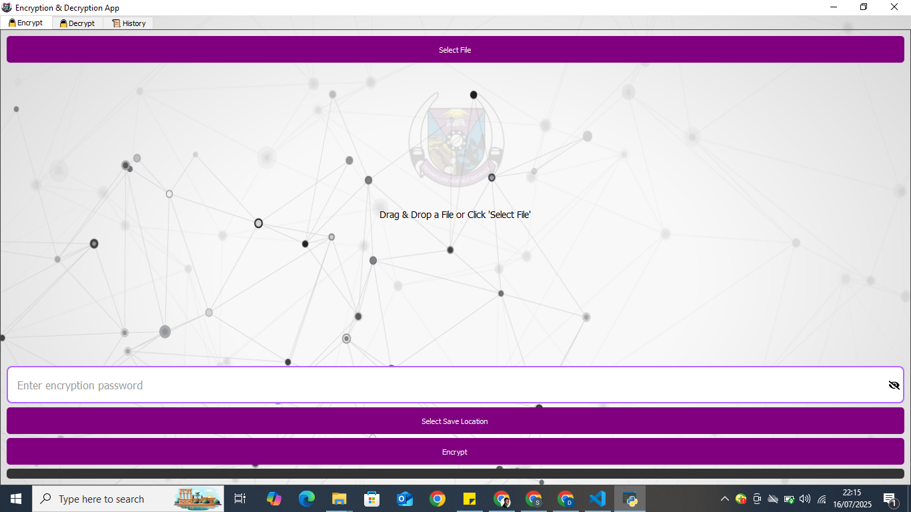
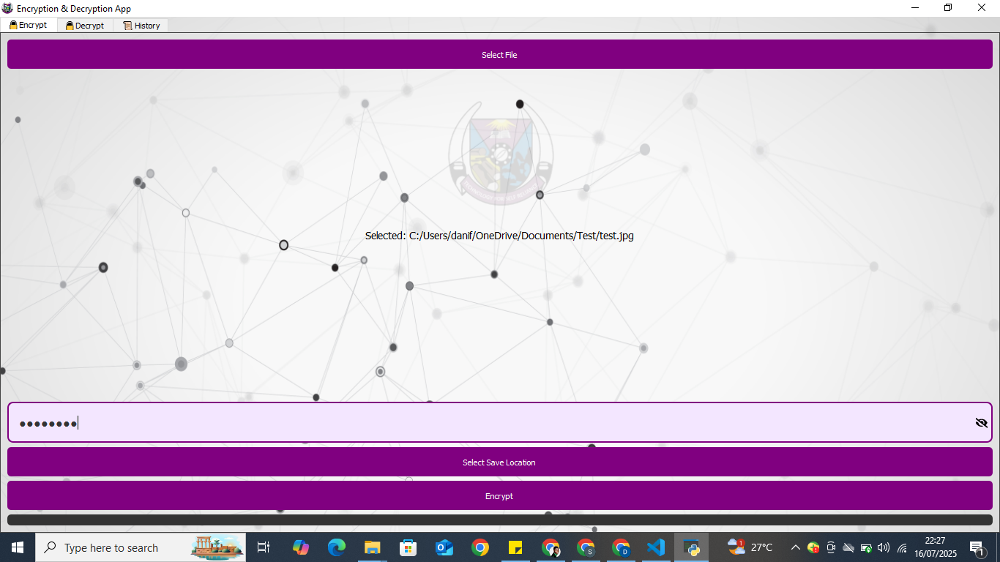
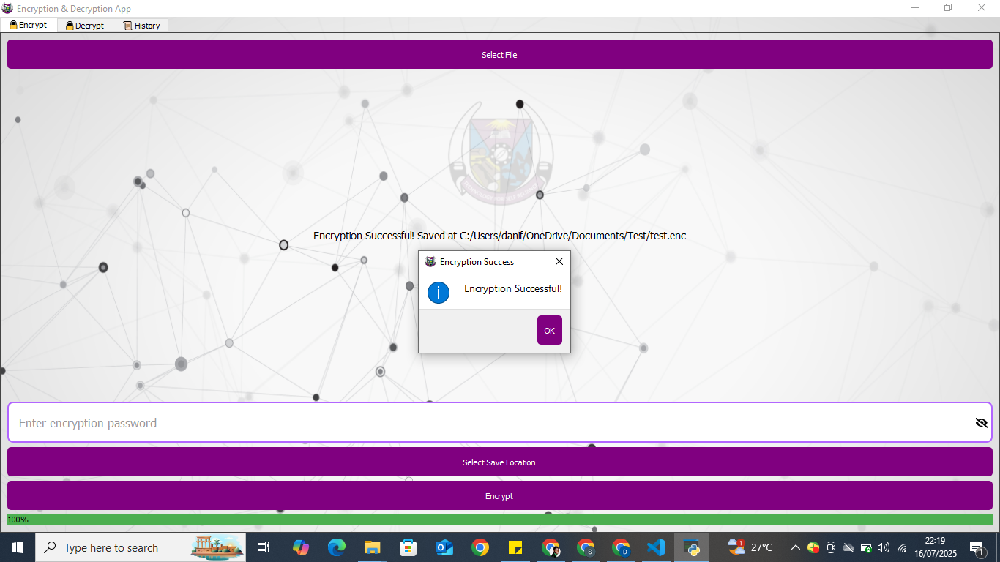
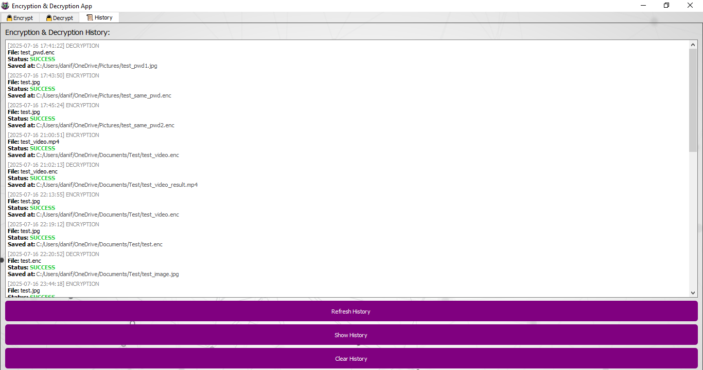

# 🔐 AES File Encryptor - Educational Sector Security Application

[](https://www.python.org/)
[](https://www.riverbankcomputing.com/software/pyqt/)
[](https://flask.palletsprojects.com/)
[](LICENSE)

> **Final Year Project** - Federal University of Technology, Akure  
> **Author:** Daniel  Ayoola
> **Department:** Cybersecurity  
> **Supervisor:** Prof. B.K. Alese  
> **Thesis Topic:** *"An Encryption Application for the Educational Sector using AES Algorithm"*

---

## 📋 Table of Contents

- [Introduction](#introduction)
- [Features](#features)
- [Technology Stack](#technology-stack)
- [Security Architecture](#security-architecture)
- [Installation](#installation)
- [Usage Guide](#usage-guide)
- [Application Screenshots](#application-screenshots)
- [Project Structure](#project-structure)
- [How It Works](#how-it-works)
- [Testing](#testing)
- [Future Enhancements](#future-enhancements)
- [Contributing](#contributing)
- [License](#license)
- [Acknowledgments](#acknowledgments)

---

## 🎯 Introduction

In today's digital age, data security has become paramount, especially in educational institutions where sensitive information such as student records, research data, examination materials, and administrative documents require robust protection. This project addresses the critical need for accessible, user-friendly, and secure file encryption solutions tailored for the educational sector.

The **AES File Encryptor** is a desktop application that implements the Advanced Encryption Standard (AES) algorithm with Galois/Counter Mode (GCM) for authenticated encryption, combined with Argon2 key derivation function for enhanced password security. The application provides a seamless interface for educators, students, and administrative staff to encrypt and decrypt files without requiring deep technical knowledge of cryptography.

### Problem Statement

Educational institutions face several security challenges:
- **Data Breaches:** Unauthorized access to sensitive academic and personal information
- **Compliance Requirements:** Need to meet data protection regulations (GDPR, FERPA, etc.)
- **Limited Technical Expertise:** Non-technical users require simple encryption tools
- **File Sharing Security:** Secure transmission of confidential documents between departments

### Solution

This application provides:
- **Military-grade encryption** using AES-256-GCM
- **Password-based security** with Argon2 key derivation
- **Intuitive graphical interface** built with PyQt5
- **Comprehensive activity logging** for audit trails
- **Cross-platform compatibility** (Windows, macOS, Linux)
- **Zero-knowledge architecture** - passwords never stored

---

## ✨ Features

### Core Functionality
- 🔒 **File Encryption:** Encrypt any file type with AES-256-GCM
- 🔓 **File Decryption:** Decrypt files using the correct password
- 🎨 **Modern UI:** Clean, intuitive interface with purple-themed design
- 📂 **Drag & Drop:** Easy file selection via drag-and-drop or file browser
- 👁️ **Password Visibility Toggle:** Show/hide password for convenience
- 📊 **Real-time Progress:** Visual feedback during encryption/decryption
- 📜 **Activity History:** Complete log of all encryption/decryption operations
- ⚡ **Multi-threaded Processing:** Non-blocking UI during file operations

### Security Features
- **AES-256-GCM:** Authenticated encryption with associated data (AEAD)
- **Argon2id:** Memory-hard password hashing resistant to GPU attacks
- **Random Salt Generation:** Unique 16-byte salt per encryption
- **Random IV Generation:** Unique 12-byte initialization vector per operation
- **Authentication Tags:** Ensures data integrity and authenticity
- **Secure Memory Handling:** Sensitive data cleared after operations

### User Experience
- **Responsive Design:** Adaptive background and layout
- **Error Handling:** Clear error messages and validation
- **Success Notifications:** Visual confirmation of operations
- **History Management:** View, refresh, and clear operation logs
- **Color-coded Status:** Green for success, red for failures

---

## 🛠️ Technology Stack

### Frontend
- **PyQt5** - Cross-platform GUI framework
- **QtAwesome** - Icon library for modern UI elements

### Backend
- **Flask** - Lightweight web framework for API endpoints
- **Cryptography** - Industry-standard cryptographic library
- **Argon2-CFFI** - Password hashing function

### Architecture
- **Client-Server Model:** PyQt5 frontend communicates with Flask backend via HTTP
- **Multi-threading:** Separate threads for UI and backend operations
- **RESTful API:** Clean separation of concerns

### Dependencies
```
Flask==3.1.1
PyQt5==5.15+
cryptography>=41.0.0
argon2-cffi==23.1.0
qtawesome>=1.2.0
requests>=2.31.0
```

---

## 🔐 Security Architecture

### Encryption Process

```
User File → Read Binary Data → Generate Salt (16 bytes) → Generate IV (12 bytes)
                                         ↓
                          Derive Key using Argon2id (password + salt)
                                         ↓
                          AES-256-GCM Encryption (key + IV + data)
                                         ↓
                    Encrypted File: [Salt][IV][Ciphertext + Auth Tag]
```

### Argon2 Parameters
- **Memory Cost:** 102,400 KiB (100 MiB) - Resistant to memory-hard attacks
- **Time Cost:** 2 iterations - Balance between security and performance
- **Parallelism:** 8 threads - Utilizes multi-core processors
- **Hash Length:** 32 bytes (256 bits) - AES-256 key size
- **Type:** Argon2id - Hybrid mode resistant to both side-channel and GPU attacks

### Decryption Process

```
Encrypted File → Extract Salt (first 16 bytes) → Extract IV (next 12 bytes)
                                         ↓
                          Derive Key using Argon2id (password + salt)
                                         ↓
                    AES-256-GCM Decryption (key + IV + ciphertext)
                                         ↓
                          Verify Authentication Tag
                                         ↓
                    Original File (if password correct and data intact)
```

### Security Guarantees
1. **Confidentiality:** AES-256 encryption prevents unauthorized access
2. **Integrity:** GCM authentication tag detects tampering
3. **Authenticity:** Verifies data hasn't been modified
4. **Forward Secrecy:** Unique salt and IV per encryption
5. **Password Security:** Argon2 prevents brute-force attacks

---

## 📥 Installation

### Prerequisites
- Python 3.8 or higher
- pip (Python package manager)
- Virtual environment (recommended)

### Step 1: Clone the Repository
```bash
git clone https://github.com/dfizzy247/aes-file-encryptor.git
cd aes-file-encryptor
```

### Step 2: Create Virtual Environment
```bash
# Windows
python -m venv venv
venv\Scripts\activate

# macOS/Linux
python3 -m venv venv
source venv/bin/activate
```

### Step 3: Install Dependencies
```bash
pip install -r requirements.txt
```

### Step 4: Run the Application
```bash
python run.py
```

The application will:
1. Start the Flask backend server on `http://127.0.0.1:5000`
2. Launch the PyQt5 desktop interface
3. Display the encryption tab as the home screen

---

## 📖 Usage Guide

### Encrypting a File

1. **Launch the Application**
   - Run `python run.py` from the project directory
   - The application opens with the **Encrypt** tab active

   

2. **Select File to Encrypt**
   - Click **"Select File"** button or drag & drop a file
   - A file dialog will appear

   

3. **Confirm File Selection**
   - The selected file path appears in the interface

   

4. **Enter Encryption Password**
   - Type a strong password in the password field
   - Use the eye icon to toggle password visibility
   - **Important:** Remember this password - it cannot be recovered!

   

5. **Choose Save Location**
   - Click **"Select Save Location"**
   - Choose where to save the encrypted file (`.enc` extension)

6. **Encrypt the File**
   - Click **"Encrypt"** button
   - Progress bar shows encryption status
   - Success message appears when complete

   

### Decrypting a File

1. **Switch to Decrypt Tab**
   - Click the **"🔓 Decrypt"** tab

2. **Select Encrypted File**
   - Click **"Select Encrypted File"** or drag & drop
   - Choose the `.enc` file you want to decrypt

   

3. **Enter Decryption Password**
   - Type the same password used for encryption
   - Toggle visibility if needed

4. **Choose Save Location**
   - Select where to save the decrypted file

5. **Decrypt the File**
   - Click **"Decrypt"** button
   - Success message confirms decryption

   

### Verify Terminal Output (Optional)
   - Check console for derived key and salt information

   

### Viewing History

1. **Navigate to History Tab**
   - Click the **"📜 History"** tab

2. **View Operations**
   - See all encryption/decryption operations
   - Color-coded status (green = success, red = failed)
   - Timestamps and file paths included

   

3. **Manage History**
   - **Refresh History:** Update the display
   - **Show Full History:** View all records
   - **Clear History:** Remove all log entries

---

## 📁 Project Structure

```
aes-file-encryptor/
│
├── backend/
│   ├── __init__.py
│   ├── app.py              # Flask API endpoints
│   └── crypto.py           # Encryption/decryption logic
│
├── frontend/
│   ├── __init__.py
│   ├── main.py             # Main window and UI setup
│   ├── encrypt_tab.py      # Encryption tab UI
│   ├── decrypt_tab.py      # Decryption tab UI
│   ├── history_tab.py      # History tab UI
│   └── asset/
│       ├── 900.png         # Background image
│       └── encrypts.ico    # Application icon
│
├── run.py                  # Application entry point
├── requirements.txt        # Python dependencies
├── encryption_history.log  # Operation logs (auto-generated)
├── README.md              # This file
└── LICENSE                # MIT License

```

---

## ⚙️ How It Works

### Application Architecture

The application uses a **hybrid architecture** combining desktop GUI with a local web server:

1. **PyQt5 Frontend (Client)**
   - Handles user interface and interactions
   - Manages file selection and display
   - Sends HTTP requests to Flask backend
   - Displays results and progress

2. **Flask Backend (Server)**
   - Runs on `localhost:5000`
   - Provides `/encrypt` and `/decrypt` endpoints
   - Performs cryptographic operations
   - Logs all activities

3. **Multi-threading**
   - Flask runs in a separate `QThread`
   - Encryption/decryption operations run in worker threads
   - UI remains responsive during operations

### Encryption Algorithm Details

**AES-256-GCM (Advanced Encryption Standard - Galois/Counter Mode)**
- **Block Cipher:** AES with 256-bit key
- **Mode:** GCM (provides both encryption and authentication)
- **Key Size:** 256 bits (32 bytes)
- **IV Size:** 96 bits (12 bytes)
- **Tag Size:** 128 bits (16 bytes)

**Argon2id Key Derivation**
- Converts user password into cryptographic key
- Resistant to:
  - Brute-force attacks
  - Dictionary attacks
  - Rainbow table attacks
  - GPU-based attacks
  - Side-channel attacks

### File Format

Encrypted files have the following structure:

```
[16 bytes: Salt][12 bytes: IV][Variable: Ciphertext + 16-byte Auth Tag]
```

- **Salt:** Random value for key derivation
- **IV:** Initialization vector for AES-GCM
- **Ciphertext:** Encrypted file data
- **Auth Tag:** GCM authentication tag for integrity

---

## 🧪 Testing

### Manual Testing Checklist

- [ ] Encrypt a text file
- [ ] Decrypt the encrypted file
- [ ] Verify decrypted content matches original
- [ ] Test with different file types (PDF, images, videos)
- [ ] Test with large files (>100 MB)
- [ ] Test incorrect password (should fail gracefully)
- [ ] Test corrupted encrypted file (should detect tampering)
- [ ] Verify history logging
- [ ] Test drag-and-drop functionality
- [ ] Test password visibility toggle

### Security Testing

- [ ] Verify unique salt for each encryption
- [ ] Verify unique IV for each encryption
- [ ] Confirm password not stored anywhere
- [ ] Test authentication tag validation
- [ ] Verify Argon2 parameters are applied
- [ ] Check encrypted files are not human-readable

---

## 🚀 Future Enhancements

### Planned Features
- [ ] **Batch Encryption:** Encrypt multiple files simultaneously
- [ ] **Folder Encryption:** Encrypt entire directories
- [ ] **Cloud Integration:** Direct upload to cloud storage
- [ ] **Password Strength Meter:** Visual feedback on password quality
- [ ] **Key File Support:** Use files as additional authentication
- [ ] **Compression:** Compress files before encryption
- [ ] **File Shredding:** Secure deletion of original files
- [ ] **Export/Import History:** Backup and restore logs
- [ ] **Multi-language Support:** Internationalization
- [ ] **Dark Mode:** Alternative UI theme

### Mobile & Web Versions
- [ ] **Web Application:** Browser-based encryption tool
- [ ] **Mobile Apps:** iOS and Android versions
- [ ] **Progressive Web App (PWA):** Offline-capable web app

### Advanced Security
- [ ] **Two-Factor Authentication:** Additional security layer
- [ ] **Biometric Authentication:** Fingerprint/face recognition
- [ ] **Hardware Security Module (HSM):** Integration with hardware tokens
- [ ] **Zero-Knowledge Proof:** Enhanced privacy features

---

## 🤝 Contributing

Contributions are welcome! Please follow these guidelines:

1. **Fork the repository**
2. **Create a feature branch**
   ```bash
   git checkout -b feature/your-feature-name
   ```
3. **Commit your changes**
   ```bash
   git commit -m "Add: your feature description"
   ```
4. **Push to the branch**
   ```bash
   git push origin feature/your-feature-name
   ```
5. **Open a Pull Request**

### Code Style
- Follow PEP 8 for Python code
- Add docstrings to all functions
- Include type hints where applicable
- Write unit tests for new features

---

## 📄 License

This project is licensed under the **MIT License** - see the [LICENSE](LICENSE) file for details.

```
MIT License

Copyright (c) 2025 Daniel

Permission is hereby granted, free of charge, to any person obtaining a copy
of this software and associated documentation files (the "Software"), to deal
in the Software without restriction, including without limitation the rights
to use, copy, modify, merge, publish, distribute, sublicense, and/or sell
copies of the Software, and to permit persons to whom the Software is
furnished to do so, subject to the following conditions:

The above copyright notice and this permission notice shall be included in all
copies or substantial portions of the Software.

THE SOFTWARE IS PROVIDED "AS IS", WITHOUT WARRANTY OF ANY KIND, EXPRESS OR
IMPLIED, INCLUDING BUT NOT LIMITED TO THE WARRANTIES OF MERCHANTABILITY,
FITNESS FOR A PARTICULAR PURPOSE AND NONINFRINGEMENT. IN NO EVENT SHALL THE
AUTHORS OR COPYRIGHT HOLDERS BE LIABLE FOR ANY CLAIM, DAMAGES OR OTHER
LIABILITY, WHETHER IN AN ACTION OF CONTRACT, TORT OR OTHERWISE, ARISING FROM,
OUT OF OR IN CONNECTION WITH THE SOFTWARE OR THE USE OR OTHER DEALINGS IN THE
SOFTWARE.
```

---

## 🙏 Acknowledgments

### Academic Supervision
- **Prof. B.K. Alese** - Project Supervisor, Federal University of Technology, Akure
- **Department of Cybersecurity** - FUTA

### Technical Resources
- **NIST** - AES Standard and Cryptographic Guidelines
- **OWASP** - Security Best Practices
- **Python Cryptographic Authority** - Cryptography Library
- **PyQt5 Community** - GUI Framework Support

### Libraries & Frameworks
- [Cryptography](https://cryptography.io/) - Modern cryptographic recipes
- [Argon2](https://github.com/P-H-C/phc-winner-argon2) - Password hashing
- [Flask](https://flask.palletsprojects.com/) - Web framework
- [PyQt5](https://www.riverbankcomputing.com/software/pyqt/) - GUI framework
- [QtAwesome](https://github.com/spyder-ide/qtawesome) - Icon fonts

### Inspiration
This project was inspired by the need for accessible encryption tools in educational environments and the desire to contribute to data security awareness in academic institutions.

---

## 📞 Contact

**Daniel Ayoola**

- **GitHub:** [@dfizzy247](https://github.com/dfizzy247)
- **LinkedIn:** [Daniel (Oluwadurotimi) Ayoola](www.linkedin.com/in/daniel-ayoola)

---

## 📊 Project Statistics

- **Lines of Code:** ~1,500+
- **Programming Language:** Python
- **Supported Platforms:** Windows, macOS, Linux
- **Encryption Standard:** AES-256-GCM
- **Key Derivation:** Argon2id

---

## ⚠️ Disclaimer

This software is provided for educational and research purposes. While it implements industry-standard encryption algorithms, users should:

1. **Keep passwords secure** - Lost passwords cannot be recovered
2. **Backup important files** - Always maintain unencrypted backups
3. **Test thoroughly** - Verify encryption/decryption before relying on it
4. **Use responsibly** - Comply with local laws and regulations
5. **Stay updated** - Keep dependencies and libraries current

**Note:** This application is part of an academic thesis and should be evaluated in that context. For production use, additional security audits and testing are recommended.

---

<div align="center">

**⭐ If you find this project useful, please consider giving it a star! ⭐**

Made with ❤️ for the Educational Sector

</div>
